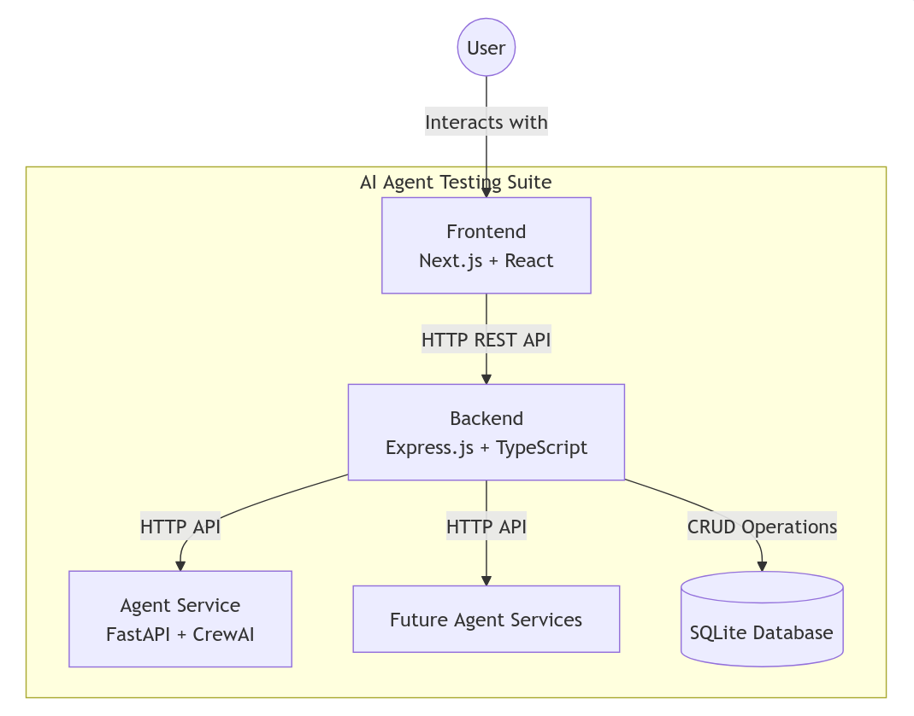

# IBM VIBE - Architecture

## Overview

The IBM VIBE is a comprehensive platform for testing AI agents, comparing their performance, and iterating on agent configurations. The application provides a user-friendly interface for managing test cases, executing tests against different agent versions, and analyzing results.

## Monorepo Structure

This project is organized as a monorepo with the following components:

```bash
ai-agent-testing-suite/
├── frontend/           # Next.js user interface
├── backend/            # Express.js API server
├── agent-service/      # Python FastAPI service for CrewAI agents
├── agent-service-api/  # TypeScript Express communication layer
└── docs/               # Documentation and diagrams
```

## System Architecture



Mermaid source: [`docs/diagrams/high-level-component-diagram.mermaid`](docs/diagrams/high-level-component-diagram.mermaid)

The system consists of four main components:

### 1. Frontend (`frontend/`)

**Technology Stack:** Next.js, TypeScript, SCSS, Carbon React

**Key Features:**

- Test management UI (create, edit, delete tests)
- Agent configuration UI (create, edit agent versions)
- Test results visualization with intermediate steps
- Comparison view for different agent versions
- Support for multiple agent types (CrewAI and External API)
- Job management and monitoring interface

### 2. Backend (`backend/`)

**Technology Stack:** TypeScript, Express.js, better-sqlite3

**Key Features:**

- REST API for test and agent management
- Test execution coordination with agent services
- Data persistence for test results and agent configurations
- Agent service factory for handling different agent types
- Support for external API integration

### 3. Agent Service (`agent-service/`)

**Technology Stack:** Python, FastAPI, CrewAI

**Key Features:**

- Agent execution using CrewAI framework
- Support for various LLM providers (currently Ollama)
- Detailed logging of intermediate steps
- Metrics collection (token usage, model calls, etc.)
- Configurable agent settings (role, goal, backstory, etc.)
- Support for tools and delegation

**Status note:** The Python `agent-service` is currently out of date and needs TLC. The primary maintained execution path is `backend` + `agent-service-api`.

### 4. Agent Service API (`agent-service-api/`)

**Technology Stack:** TypeScript, Express.js

**Key Features:**

- Polls backend jobs and executes external API workloads
- Conversation execution with full transcript/session persistence
- Error handling and request validation
- Status tracking for running tests
- Support for external API configuration:
  - API endpoint configuration
  - Request/response mapping
  - Custom headers and authentication
  - Template-based request formatting
  - Response validation and success criteria

## Agent Types

The system supports two main types of agents:

### 1. CrewAI Agents

- Configured with role, goal, and backstory
- Support for tools and delegation
- LLM configuration (model, temperature, etc.)
- Memory and code execution options

### 2. External API Agents

- Connect to any external AI service
- Configurable request/response mapping
- Support for custom headers and authentication
- Template-based request formatting
- Response validation and success criteria

## Data Model

A high-level ER diagram is maintained as a Mermaid source file:

- [`docs/diagrams/entity-relationship-diagram.mermaid`](docs/diagrams/entity-relationship-diagram.mermaid)

The system uses SQLite for data persistence with the following key entities (legacy + conversation-centric during migration):

- **agents**: Store agent configurations and versions
- **conversations**: Reusable multi-turn test definitions
- **conversation_messages**: Ordered conversation scripts (user/system messages)
- **execution_sessions**: A concrete run of a conversation by an agent
- **session_messages**: Full execution transcript with timestamps and metadata (tokens, tool calls, scoring, etc.)
- **jobs**: Work queue items referencing a `conversation_id` (preferred) or legacy `test_id`
- **test_suites / suite_entries / suite_runs**: Suite composition and execution tracking
- **tests / results**: Legacy single-turn test artifacts (supported during the transition)
- **request_templates / response_maps**: Global communication configs linked to agents via `agent_template_links` and `agent_response_map_links`

## Integration Points

### Frontend ↔ Backend

- **Protocol:** HTTP REST API
- **Purpose:** Test and agent management, result visualization
- **Authentication:** User session management

### Backend ↔ Agent Service API

- **Protocol:** HTTP API
- **Purpose:** Test execution coordination
- **Data:** Job management and status tracking

### Agent Service API ↔ External AI APIs

- **Protocol:** HTTP API
- **Purpose:** Execute external API conversations/tests
- **Data:** Formatted requests, mapped responses, usage metadata

### Backend ↔ Agent Service (Python)

- **Protocol:** HTTP API (FastAPI)
- **Purpose:** Direct CrewAI execution path (optional/legacy-maintained)
- **Data:** Agent configurations, conversation/test inputs, execution outputs

### Backend ↔ Database

- **Protocol:** SQLite (better-sqlite3)
- **Purpose:** Data persistence
- **Operations:** CRUD operations for all entities

## Development Workflow

1. **Frontend Development**: UI components and user interactions
2. **Backend Development**: API endpoints and business logic
3. **Agent Development**: CrewAI configurations and external API integrations
4. **Testing**: Automated testing across all components
5. **Integration**: End-to-end testing of complete workflows

## Deployment Considerations

- **Frontend**: Static site deployment (Vercel, Netlify)
- **Backend**: Node.js server deployment
- **Agent Service**: Python ASGI server deployment
- **Database**: SQLite file-based storage
- **Monitoring**: Log aggregation and performance monitoring

## Code Style

- Use sentence capitalization for strings (including titles)
- Add new line at the end of files
- Follow TypeScript/JavaScript best practices
- Use Python PEP 8 for Python components

## Diagrams

- [High-Level Component Diagram (Mermaid source)](docs/diagrams/high-level-component-diagram.mermaid)
- [Entity Relationship Diagram (Mermaid source)](docs/diagrams/entity-relationship-diagram.mermaid)
- [Sequence diagram (Mermaid source)](docs/diagrams/sequence-diagram.mermaid)
