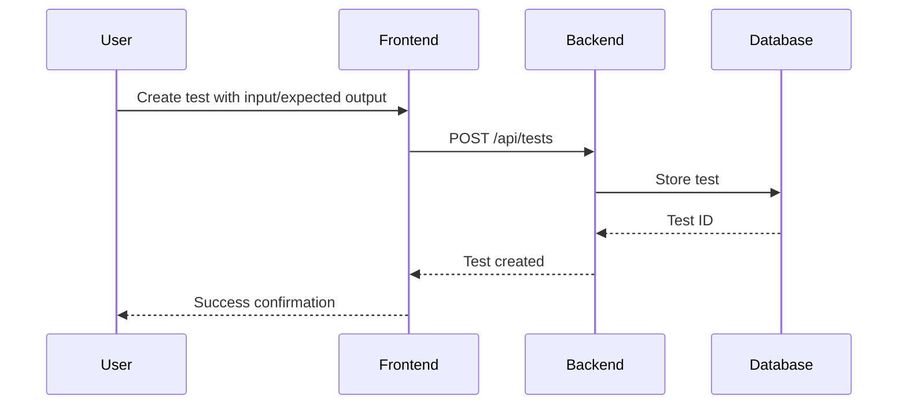
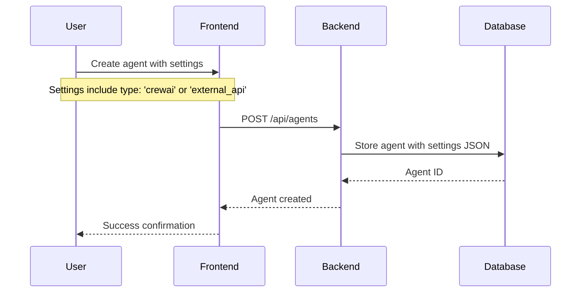
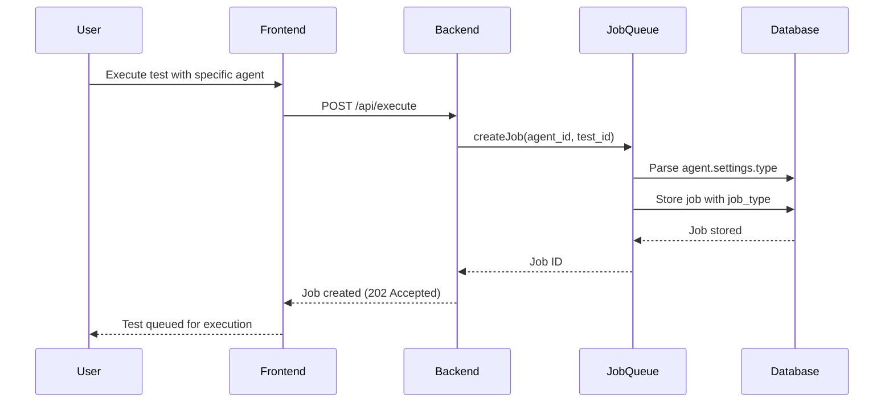
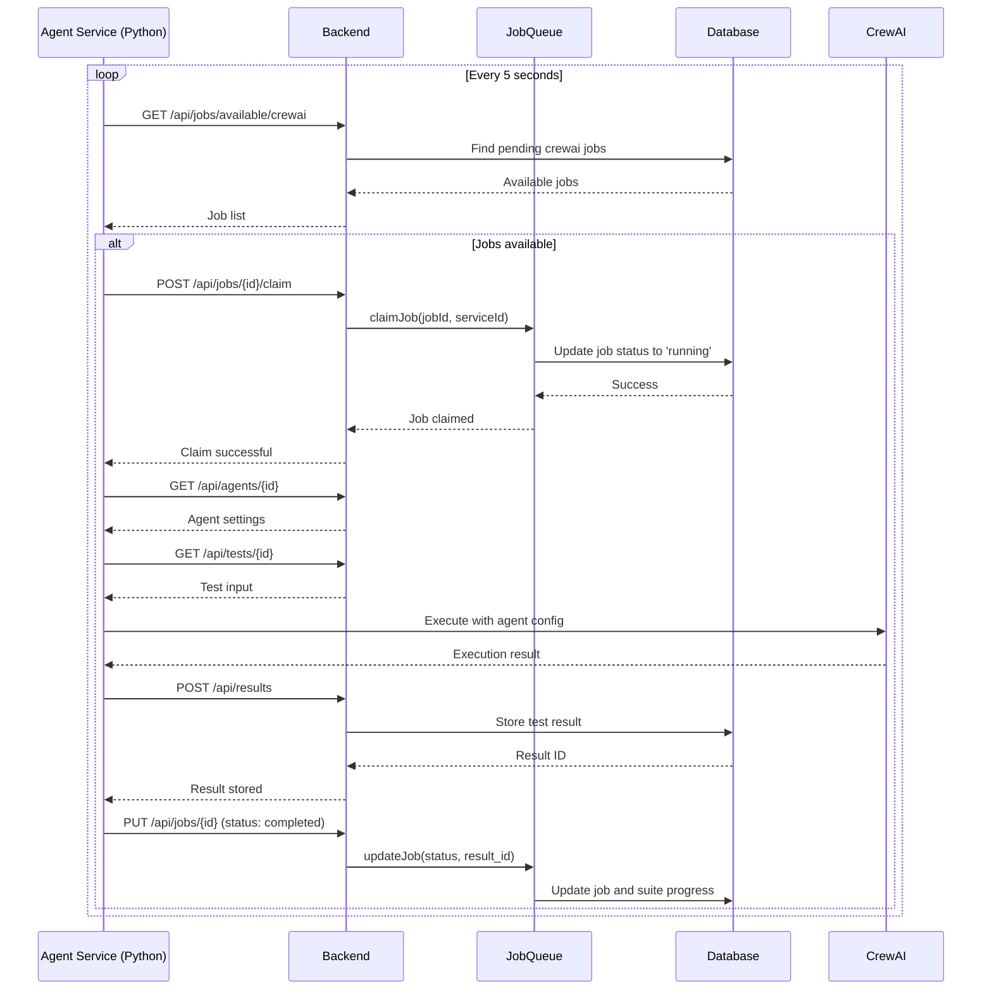
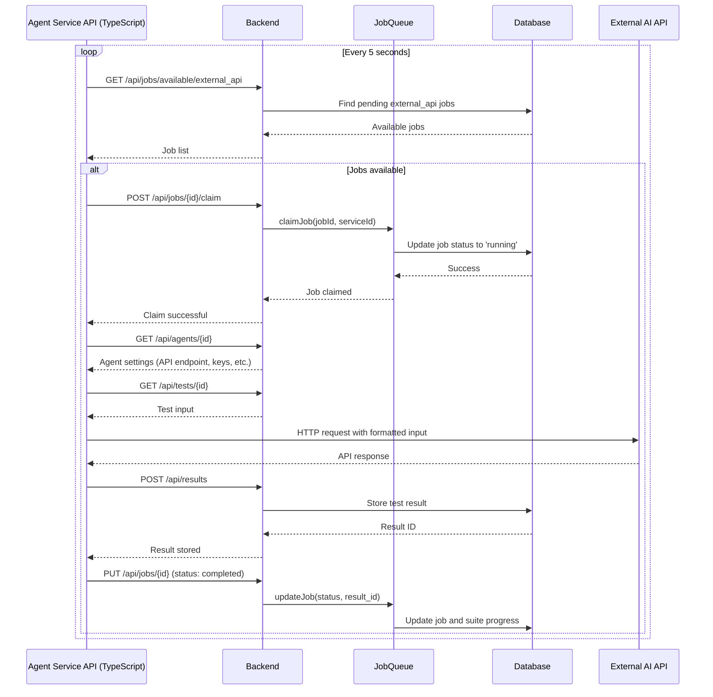
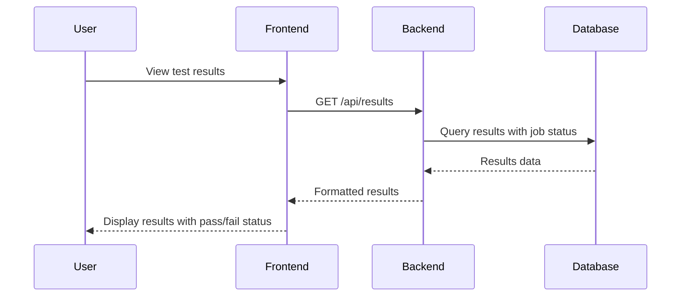
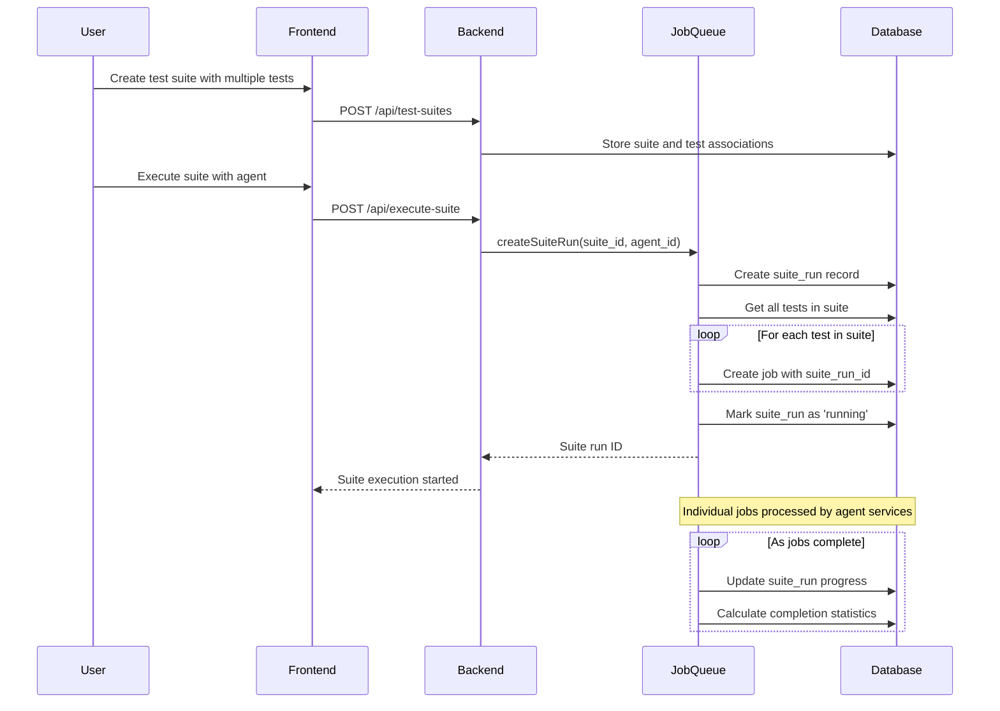

# AI Agent Testing Suite - Developer Flow Documentation

## Overview

This document provides a comprehensive guide to understanding how the AI Agent Testing Suite works from a developer's perspective. It covers the complete flow from test creation to result visualization, explaining the interactions between all system components.

## System Architecture

The AI Agent Testing Suite uses a **microservices architecture** with job polling for scalability and fault tolerance:

```
┌─────────────────┐    ┌──────────────────┐    ┌─────────────────────┐
│    Frontend     │    │     Backend      │    │   Agent Services    │
│   (Next.js)     │◄──►│   (Express.js)   │    │                     │
│                 │    │                  │    │  ┌───────────────┐  │
│ - Test Creation │    │ - Job Scheduling │    │  │ agent-service │  │
│ - Suite Mgmt    │    │ - Progress Track │    │  │   (CrewAI)    │  │
│ - Result View   │    │ - Result Storage │    │  └───────────────┘  │
└─────────────────┘    │                  │    │                     │
                       │ - SQLite Database│    │  ┌───────────────┐  │
                       │ - REST API       │    │  │agent-service- │  │
                       └──────────────────┘    │  │    api        │  │
                                               │  │(External APIs)│  │
                                               └──┴───────────────┴──┘
```

## Core Components

### 1. Frontend (`/frontend`)

- **Technology**: Next.js with React and Carbon Design System
- **Purpose**: User interface for creating tests, managing agents, and viewing results
- **Key Features**: Test execution, suite management, result visualization

### 2. Backend (`/backend`)

- **Technology**: Express.js with TypeScript
- **Purpose**: Central coordinator and data store
- **Key Features**: Job scheduling, progress tracking, result storage, REST API

### 3. Agent Service (`/agent-service`)

- **Technology**: Python with FastAPI and CrewAI
- **Purpose**: Executes tests using CrewAI agents
- **Agent Type**: `crewai` (local AI agents with tools and workflows)

### 4. Agent Service API (`/agent-service-api`)

- **Technology**: TypeScript with Express.js
- **Purpose**: Executes tests using external API agents
- **Agent Type**: `external_api` (third-party AI services like OpenAI, Anthropic)

### 5. Shared Types (`/packages/types`)

- **Purpose**: Single source of truth for TypeScript interfaces
- **Usage**: Imported by frontend, backend, and agent-service-api via `@ibm-vibe/types`
- **Key Content**: `Job`, `Agent`, `Conversation` definitions

## Complete Test Execution Flow

### Phase 1: Test Setup



### Phase 2: Agent Configuration



### Phase 3: Job Creation & Scheduling



### Phase 4A: CrewAI Agent Execution



### Phase 4B: External API Agent Execution



### Phase 5: Result Viewing



## Test Suite Execution Flow

Test suites allow running multiple tests together for comprehensive evaluation:

### Suite Creation & Execution



## Key Data Flows

### 1. Agent Settings & Job Type Determination

```typescript
// Agent settings example for CrewAI
{
  "type": "crewai",
  "role": "Research Assistant", 
  "goal": "Find accurate information",
  "backstory": "You are an AI research assistant...",
  "llm_config": {
    "provider": "ollama",
    "model": "llama2"
  }
}

// Agent settings example for External API
{
  "type": "external_api",
  "api_endpoint": "https://api.openai.com/v1/chat/completions",
  "api_key": "sk-...",
  "request_template": "{\"model\": \"gpt-4\", \"messages\": [{\"role\": \"user\", \"content\": \"{{input}}\"}]}",
  "response_mapping": "{\"output\": \"choices.0.message.content\"}"
}
```

### 2. Job Lifecycle States

```
pending -> running -> completed/failed/timeout
    ^         v
    └─── (retry) ───┘
```

### 3. Progress Calculation

```typescript
// Suite run progress calculation
const completedJobs = jobs.filter(job => 
  job.status === 'completed' || 
  job.status === 'failed' || 
  job.status === 'timeout'
);
const progress = Math.floor((completedJobs.length / totalJobs) * 100);
```

## Error Handling & Fault Tolerance

### 1. Service Failures

- **Job Claiming**: Prevents duplicate execution when multiple services are running
- **Stale Job Detection**: Jobs running too long are reset to pending
- **Service Restart**: Running jobs are reset to pending on service startup

### 2. API Failures

- **Timeouts**: External API calls have configurable timeouts
- **Retries**: Failed jobs can be retried manually
- **Graceful Degradation**: Frontend shows job status even when services are down

### 3. Data Consistency

- **Fallback Calculations**: Suite runs recalculate progress if database values seem stale
- **Atomic Operations**: Job claiming uses database transactions
- **Status Reconciliation**: Regular cleanup processes ensure data consistency

## Development Workflow

### 1. Adding a New Agent Type

1. Define agent settings schema in `backend/src/types.ts`
2. Update job type determination logic in `JobQueueService`
3. Create new agent service or extend existing one
4. Implement polling and execution logic
5. Update frontend agent creation forms

### 2. Adding New Test Features

1. Update test schema in database
2. Modify test CRUD operations in `backend/src/routes/tests.ts`
3. Update frontend test creation components
4. Ensure agent services handle new test properties

### 3. Debugging Test Execution

1. Check job status in database or via `/api/jobs/{id}`
2. Review agent service logs for execution details
3. Verify agent settings JSON is valid
4. Check intermediate steps in test results

## Performance Considerations

### 1. Concurrent Execution

- Multiple agent service instances can run simultaneously
- Job claiming prevents conflicts
- Configure polling intervals based on load

### 2. Database Optimization

- Indexes on frequently queried fields (agent_id, test_id, status)
- Regular cleanup of old completed jobs
- Suite run progress caching

### 3. Memory Management

- Job queue maintains in-memory cache for active jobs
- Periodic cleanup of completed jobs from memory
- Service restart clears memory state

## Security Considerations

### 1. API Keys

- External API keys stored in agent settings
- Consider encryption for sensitive credentials
- Audit trail for agent modifications

### 2. Input Validation

- All user inputs validated before database storage
- Agent settings JSON validated before job creation
- Test inputs sanitized before execution

### 3. Service Communication

- Agent services authenticate with backend
- Consider rate limiting for API endpoints
- Monitor for unusual job patterns

## Monitoring & Observability

### 1. Key Metrics

- Job completion rates by agent type
- Average execution times
- Service health and availability
- Queue depth and processing rates

### 2. Logging

- Structured logging across all services
- Job lifecycle events
- Error conditions and recovery actions
- Performance metrics

### 3. Health Checks

- Service availability endpoints
- Database connectivity checks
- External API reachability tests

## Common Issues & Solutions

### 1. Jobs Stuck in "Running" State

- **Cause**: Service crashed during execution
- **Solution**: Restart services (jobs reset to pending automatically)

### 2. Incorrect Progress Calculation

- **Cause**: Database values not updated properly
- **Solution**: Fallback calculation in suite-runs route handles this

### 3. Agent Service Not Picking Up Jobs

- **Cause**: Wrong job type or service not running
- **Solution**: Check agent settings type and service status

### 4. External API Authentication Failures

- **Cause**: Invalid API keys or endpoint configuration
- **Solution**: Verify agent settings and test API connectivity

This documentation should help new developers understand the complete flow and architecture of the AI Agent Testing Suite.
